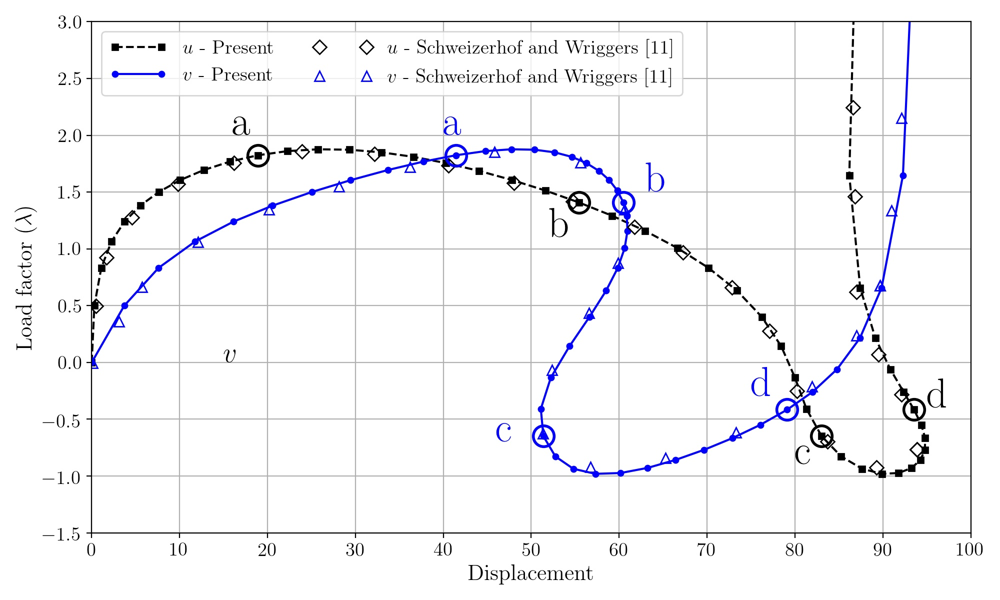
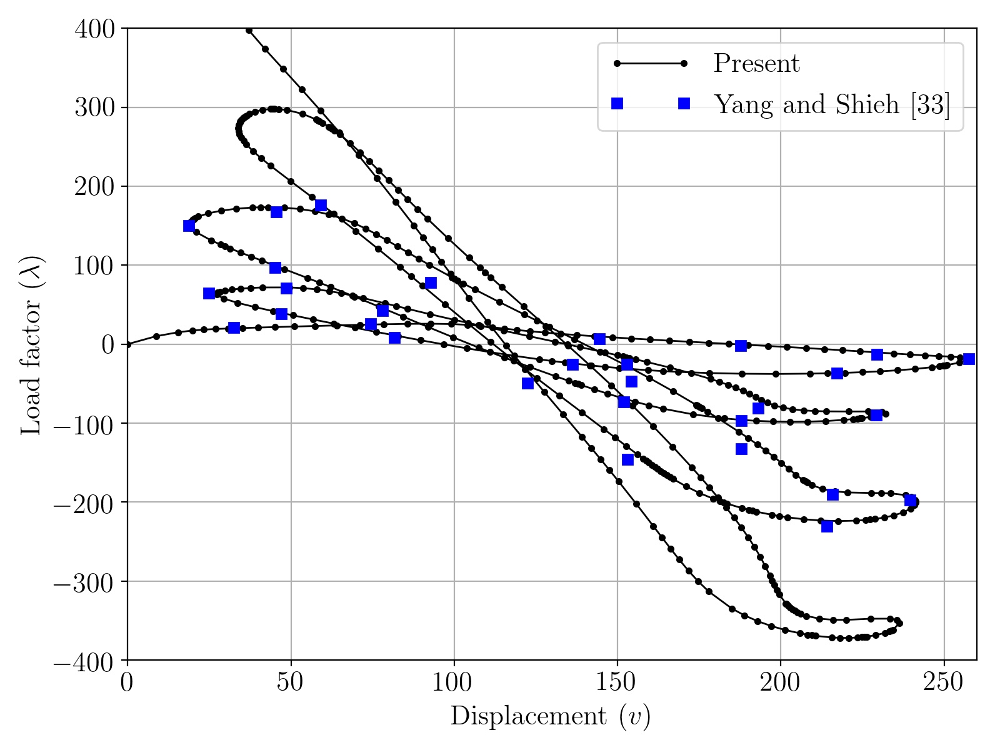

## Introduction
**Julia** implementation of the Finite Element Method for linear and nonlinear structural mechanics problems.

It offers two methods:
1. Newton-Raphson method.
    * Main script is **Newtonraphson.jl**.
    * Supports linear and nonlinear elements. Linear elements converge in 1 iteration.
2. Arc-length method.
    * Main script is **Arclength.jl**.
    * Supports only nonlinear elements, for obvious reasons.
    * Use only for problems with instabilities.

The arc-length method implementation is based on a novel a extrapolated predictor recently proposed in [Engineering Structures journal](https://www.sciencedirect.com/science/article/pii/S014102962034356X). You can download a PDF copy from [ArXiv](https://arxiv.org/pdf/2005.10192.pdf).

The input files are prepared and tested. They are available in the *inputs* subfolder.

## Running the scripts
The command sytax to run the program is

`$julia  <solver>  <input-directory> <input-file>`

For example, to run *LeeFrame-nelem10.inp* located in *./inputs/LeeFrame* using Newton-Raphson method, the command is

`$julia  Newtonraphson.jl  ./inputs/LeeFrame  LeeFrame-nelem10.inp`

With the Arclength method, the command is

`$julia  Arclength.jl  ./inputs/LeeFrame  LeeFrame-nelem10.inp`

## Output
The output at each converged load step is written in the legacy VTK format (.vtk extension). These files can be visualised in [ParaView](https://www.paraview.org/).

It is also possible to extract and write the solution for invidiaual DOF of a paricular node. Check the main scripts and modify accordingly.

## Some examples

Some load-displacement curves computed with this code.

* Lee frame

* 215-degree circular arch

* Semi-circular arch with asymmetric loading

