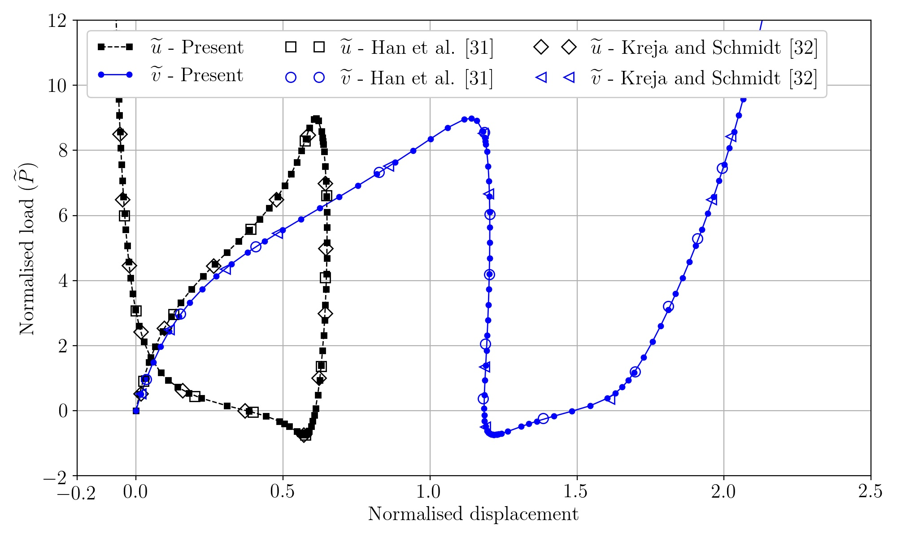

**Julia** implementation of the arc-length method for nonlinear structural mechanics problems.

This implementation is based on a novel a extrapolated predictor recently proposed in [Engineering Structures journal](https://www.sciencedirect.com/science/article/pii/S014102962034356X). You can download a PDF copy from [ArXiv](https://arxiv.org/pdf/2005.10192.pdf).

The main script is **mymain.jl**. The input files are prepared and tested.
Uncomment the corresponding line in the **main_arclength.jl** file to run the script for a particular problem.

Some load-displacement curves computed with this code.

* Lee frame

* 215-degree circular arch

* Semi-circular arch with asymmetric loading

